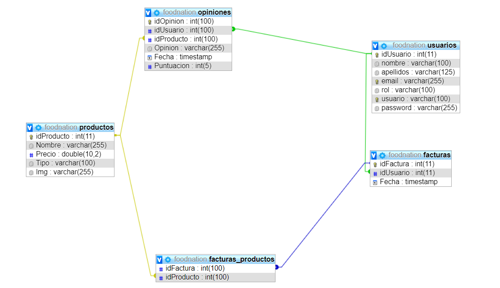

# Proyecto PHP

## FoodNation

Mi proyecto tratará sobre una tienda alimenticia desde la que podrás realizar las siguientes funciones : 
### Funciones
- Crear y acceder a una cuenta de usuario.
- Poder ver tus facturas desde un panel de usuario.
- Escribir comentarios en los productos publicados.
- Realizar compras de los productos.
- Ver recetas posibles recetas.
### Modelo E/R

### Credenciales y acceso a la web
Enlace a la página web: <http://foodnation.epizy.com/>
#### Credenciales
- <b>Usuario:</b> profesor
- <b>Contraseña:</b> 123
